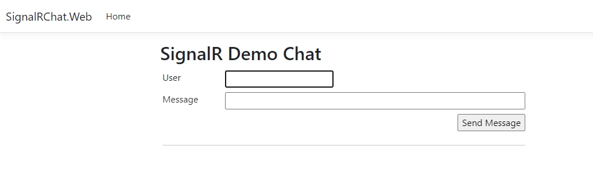

# signalR-chat
Chat system Many:Many for Distributed Systems class in ISMAT(Instituto Superior Manuel Teixeira Gomes)

# How to run project
- Enter root folder of the project, where `docker-compose.yml` is located
- Run the followin command in the CMD or other CLI, `docker-compose up -d`
- After docker runs, go over to `http://localhost:5000` and you should be able to see a page like the image suggests

# How to see Websockets in action
- Open another tab of that same url(`http://localhost:5000`), and put them side to side
- Send a message from one of the tabs, and you should see in the other tab, the sent message coming in real time

# Requirements
- [Visual Studio](https://visualstudio.microsoft.com/downloads/) or [Visual Studio Code](https://code.visualstudio.com/download) (if you want to analyze the code)
- [Docker Desktop](https://www.docker.com/products/docker-desktop/)
